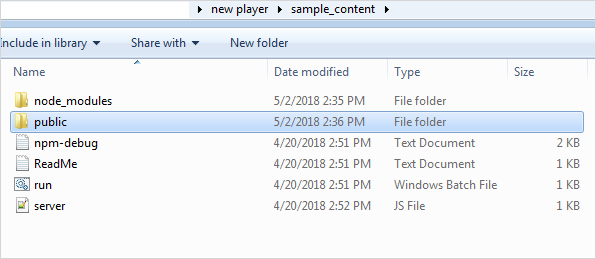

<!DOCTYPE html>
<html lang="en">
	<head>
	</head>
	<body>
		

			<h1># LMSPlayer LMS player can play content</h1>
			<h3>Introduction</h3>
			
Before HTML5, the content we used to play in a browser with a plug-in like Flash but the HTML5 &lt;Video&gt; element specified a standard way to embed a video in a web page.

			
HTML5 has attributes that allows adding controls like play/pause and volume. It also provides the built in resume functionality.

			

			 
			<h3>HTML5 Video - Media Types</h3>
			<ul>
				<li>Media formats like:</li>
				<ul>
					<li>MP4</li>
					<li>WebM</li>
					<li>Ogg</li>
				</ul>
			</ul>
			
&nbsp;

			<h3>HTML5 Video - Browser Support</h3>
			<table width="100%" class="centre" frame="box" rules="all">
				<tbody>
					<tr>
						<th width="25%">
							
<strong>Browser</strong>

						</th>
						<th width="25%">
							
<strong>MP4</strong>

						</th>
						<th width="25%">
							
<strong>WebM</strong>

						</th>
						<th width="25%">
							
<strong>Ogg</strong>

						</th>
					</tr>
					<tr>
						<td width="25%">
							
<strong>Internet Explorer</strong>

						</td>
						<td width="25%">
							
YES

						</td>
						<td width="25%">
							
NO

						</td>
						<td width="25%">
							
NO

						</td>
					</tr>
					<tr>
						<td width="25%">
							
<strong>Chrome</strong>

						</td>
						<td width="25%">
							
YES

						</td>
						<td width="25%">
							
YES

						</td>
						<td width="25%">
							
YES

						</td>
					</tr>
					<tr>
						<td width="25%">
							
<strong>Firefox</strong>

						</td>
						<td width="25%">
							
YES

						</td>
						<td width="25%">
							
YES

						</td>
						<td width="25%">
							
YES

						</td>
					</tr>
					<tr>
						<td width="25%">
							
<strong>Safari</strong>

						</td>
						<td width="25%">
							
YES

						</td>
						<td width="25%">
							
NO

						</td>
						<td width="25%">
							
NO

						</td>
					</tr>
					<tr>
						<td width="25%">
							
<strong>Opera</strong>

						</td>
						<td width="25%">
							
YES

						</td>
						<td width="25%">
							
YES

						</td>
						<td width="25%">
							
YES

						</td>
					</tr>
				</tbody>
			</table>
			
&nbsp;

			<h3>Controls</h3>
			<table width="100%" class="centre" frame="box" rules="all" s tyle="display:block;">
				<tbody>
					<tr>
						<th width="15%">
							
<strong>Sr. No.</strong>

						</th>
						<th width="20%">
							
<strong>Name of Buttons</strong>

						</th>
						<th width="35%">
							
<strong>Function</strong>

						</th>
						<th width="30%">
							
<strong>Identity</strong>

						</th>
					</tr>
					<tr>
						<td>
							
<strong>1 </strong>

						</td>
						<td>
							
Volume control

						</td>
						<td>
							
Control the volume (Increase / decrease / mute)

						</td>
						<td></td>
					</tr>
					<tr>
						<td>
							
<strong>2</strong>

						</td>
						<td>
							
Play / Pause

						</td>
						<td>
							
Play / Pause the video, by clicking on this button

						</td>
						<td></td>
					</tr>
					<tr>
						<td>
							
<strong>3 </strong>

						</td>
						<td>
							
Auto Mode

						</td>
						<td>
							
Once clicked, will remain on the same segment and will not move to next segment.

						</td>
						<td></td>
					</tr>
					<tr>
						<td>
							
<strong>4</strong>

						</td>
						<td>
							
Slider

						</td>
						<td>
							
Move the nugget back and forward by clicking on it and drag it forward / backward

						</td>
						<td wi dth="177"></td>
					</tr>
					<tr>
						<td>
							
<strong>5</strong>

						</td>
						<td>
							
Total time

						</td>
						<td>
							
Tells the total duration of nugget

						</td>
						<td></td>
					</tr>
				</tbody>
			</table>
			
&nbsp;

			<h3>Features</h3>
			<ul>
				<li>Buttons are available on the player to play, pause, rewind and forward (through slider bar), auto mode, Total &amp; Remaining time etc. to function the content.
				

</li>
				<li>In player, the content cannot be forwarded through a slider which is not completed but have an option to back and forward the content whatever has been played. This functionality is configurable.</li>
				<li>For activities section- it always start from the beginning of that segment. There is no option for restart/resume.
				

</li>
				
&nbsp;

				<li>Activities that run in the player are like webpages/screens that are created using HTML5, CSS, Angular. These webpages contain functionalities like:
				  		
					<ol type="1">
						<li>User can select one answer for the asked question
						

						</li>
						
&nbsp;

						<li>User can select/deselect multiple answer for the asked question
						

						

						</li>
						
&nbsp;

						<li>User also have options to move back or forward by clicking back/forward buttons inside the activity.</li>
						<li>Firework effect on selecting a correct option
						

						

						</li>
						
&nbsp;

						<li>Shaking, Shuffling and Buzzer sound on selecting a wrong option.</li>
						<li>On answering a question correctly application automatically navigates to the next question in that activity (except for last question in the activity). At the last question of the activity aage badhein starts blinking after the user has answered the
							question correctly.</li>
						<li>A help button is placed to re-hear the audio.</li>
					</ol>
				</li>
				<li>Webpages/content screen is fully responsive i.e. it works on any screen resolution.
				

				</li>
				<li>Web pages can be viewed using many different devices: desktops, tablets, Web.</li>
				<li>Design, Color, Images are dynamic and can be changed as per requirement.
&nbsp;
</li>
			</ul>
		
	
		 
		

			<h3>Creating New Content - for Activity Template</h3>
			
<b>> Create a New Content Folder</b> - Initially you will get the folder structure as below:
			
			

			
- Go to <b><i>sample_content</i></b> folder and create a <b>'public'</b> folder.
			
			

			
- In public folder create a <b>New Folder</b>, e.g. create 'content1'.
			
			

			

			- Create a <b>base.json</b> file inside <i>content1</i> folder. Internal structure of <i>base.json</i> looks as below – 
				<pre>
					{
						"autoplay": false,
						"contents": [
							"Q1",
							"Q2",
							"Q3"
						]
					}
				</pre>
			

			
<b>> Sequence of Question</b> <blockquote>You will get questions in same sequence as it appears in 'base.json'. You can re-arrange the sequence of questions in 'base.json'.</blockquote>
	 		
			
<b>> Autoplay</b> <blockquote>If autoplay (in 'base.json') is set to <b>true</b>, then the player will move on to the next activity after completion of the current playing activity. If autoplay is set to <b>false</b> then it will stay on the last question of the current playing activity.</blockquote>
 
			
<b>> Contents</b> 
			<blockquote>
				'contents' (in 'base.json') holds the list of all questions. In the above json file (base.json), there are three questions. Each question (Q1,Q2,Q3) represents their individual .json file such as <i>Q1.json</i>, <i>Q2.json</i>, <i>Q3.json</i>. 
				Sample structure of the json file will be as follows– 
				<pre>
				{
					"data": "Q1/Q1_data",
					"design": "Q1/Q1_design",
					"logic": "Q1/Q1_logic"
				}
				</pre>
			</blockquote>
 		
			
<b>> Data</b> 
			<blockquote>
				<b>'data'</b> points to a json file (<i>Q1_data.json</i>) which is inside the folder name <b>Q1</b>. 
				The file <b>Q1_data.json</b> consists of all the assets (Audio, Video, Images) required in a template.  The structure of <i>Q1_data.json</i> is shown below – 
				<pre>
				{
					"id": "Q001",
					"ques": {
						"text": "",
						"sound": "http://localhost:8080/tempfive/Q1.ogg",
						"imgsrc": "http://localhost:8080/tempfive/q1.png",
						"imgsrc_hover": "http://localhost:8080/tempfive/q1_hover.svg",
						"imgsrc_original": "http://localhost:8080/tempfive/q1.png"
					},
					"options": [{
							"id": "001",
							"custom_id": "0",
							"imgsrc": "http://localhost:8080/tempfive/q1_opt1.svg"
						},{
							"id": "002",
							"custom_id": "1",
							"imgsrc": "http://localhost:8080/tempfive/q1_opt2.svg"
						},{
							"id": "003",
							"custom_id": "2",
							"imgsrc": "http://localhost:8080/tempfive/q1_opt3.svg"
						}
					],
					"feedback": {
						"correct_ans_index": "2"
					}
				}
				</pre>
			</blockquote>
 
			
<b>> Design</b> 
			<blockquote>Here we put all the <b>Design</b> configuration to change the <i>look and feel</i> <b>dynamically</b>.</blockquote>

			 
			
<b>> Logic</b> 
				<blockquote>Here we put all the <b>Logic</b> configuration to change the <i>look and feel</i> <b>dynamically</b>. The structure of <i>logic.json</i> looks as below: 
				<pre>
				{
					"type": 0
				}
				</pre>
				In the above code <b>"type"</b> represents the <i>type of template</i>.   For example :
				<table cellpadding="7" frame="box" rules="all" style="font-size:14px; text-align:center;">
					<tr>
						<th>Type</th>
						<th>Type value</th>
					</tr>
					<tr>
						<td>0</td>
						<td>video template</td>
					</tr>				
					<tr>
						<td>1</td>
						<td>sound  to image</td>
					</tr>				
					<tr>
						<td>2</td>
						<td>text to image</td>
					</tr>				
				</table>
				</blockquote>
			
 
			

			
			 
			<h3>Template - Definition and Types</h3>
			
A Template is a set of predefined functionalities like <i>'Multiple choice questions'</i>, <i>'Arrange the sentence'</i> etc. All the templates have different functionalities as shown below–
			

			<ul>
				<li><i>Video Template</i><blockquote>This type of template is to play the video. It can play video from a specified position. Volume can also be adjusted with the help of slider.</blockquote></li>
				<li><i>Sound to Image</i><blockquote>User listens to the audio and selects the (correct) answer from the given options.</blockquote></li>
				<li><i>Letter to Image</i><blockquote>A letter will be displayed and the user will have to identify the correct Word that begins with or contains that letter in the word.</blockquote></li>
				<li><i>Arrange the Word or Sentence</i><blockquote>User will be given a jumbled word or sentence and has to re-arrange these to create a meaningful sentence or word.
				</blockquote></li>
			</ul>
			
Finally, the structure of <b>"content1"</b> folder will appear as below:

			

			
*The 'content1' folder setup completes here.

			 
			<h3>Next Step - Start Node Server</h3>
			<blockquote>To start the Node Server, follow up to <i>'new player > sample_content'</i> folder and open the command prompt here (shift + right click and select '<i>open command window here</i>' from contextual menu) and start node by typing <b>run.bat</b> in the command prompt and press 'enter'.</blockquote>
			 
			<h3>Integration with Player</h3>
			<blockquote>Go to- <i>new player >  latest_player > src > assets > config</i> 
			Here user will get <b>init.json</b></blockquote>
			

			
The structure and source of the <b>init.json</b> file is shown below:

			<pre>
			{
				"environment": {
					"standalone": {
						"enabled": true,
						"data": "{\"homePath\": \"home\",\"forwardEnabled\": true,\"playerPreview\":  false,\"sessionId\":\"kdfjddfk43243kjfkj\",\"files\":[{\"startAt\": 0,\"segmentId\": 201,\"file\": \" http://localhost:8080/content1/\"},{\"startAt\": 0,\"segmentId\": 202,\"file\": \"http://localhost:8080/content2/\"}]}"
					},
					
					"lms": {
						"enabled": false
					}
				}
			}
			</pre>
			
In <i>init.json</i> file, if player is running in LMS then <i>'LMS Enabled'</i> option is true, else <i>'Standalone Enabled'</i> is true.

			
			<ul>
				<li>Files  <blockquote>In <i>init.json</i>, <b>'files'</b> shows list of all content folders.</blockquote></li>
				<li>startAt  <blockquote>This shows the 'Time' in milliseconds, which specifies the begining time of the video. For example if you provide startAt value to 1000, then it will start video from 1 second.</blockquote></li>
				<li>Sequence of Templates  <blockquote>You can specify the <i>sequence</i> of templates by re-arranging in init.json. In above json file first you will get template 1 and then template 2.</blockquote></li>
			</ul>
			
The content is now integrated with latest player, it's time to start the player by going to folder <i>new player > latest_player</i> and open command prompt from that location (shift + right click and select '<i>open command window here</i>' from contextual menu). 
				- Type <b>run.bat</b> in the command prompt and press 'enter'. 
				- Latest player will run on port no 4200.  
				- Hence, enter url <b>localhost:4200</b> in browser to view the content.
			

			 
		

	</body>
</html>